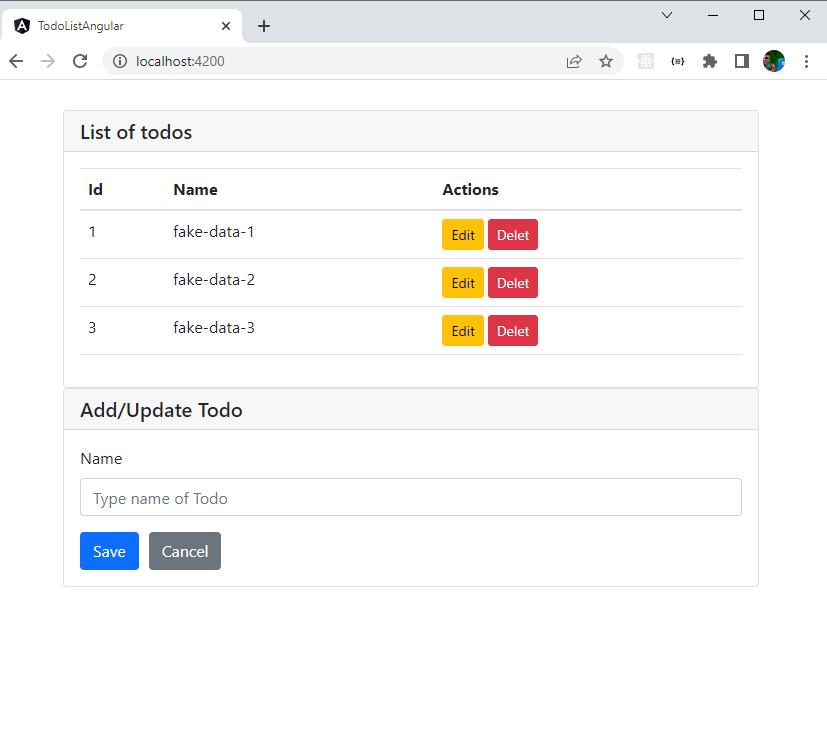

# TODO LIST COM ANGULAR
<p align="center">
  
  <br/>
</p>

### Instalando o projeto
Caso queira testa-lo em sua máquina, siga os passos abaixo:

**Inicie o servidor node**

Para isso basta seguir o passo a passo descrito no repositório:

```
https://github.com/LucasMSCaetano/todo-list-angular-api
```

**Clone este Repositorio**

```
$ git clone https://github.com/LucasMSCaetano/todo-list-angular.git

$ cd todo-list-angular

```
**Instale as dependências**

```
$ yarn
```

_ou_

```
$ npm install
```

**Agora basta executar o comando**

```
$ ng serve
```


